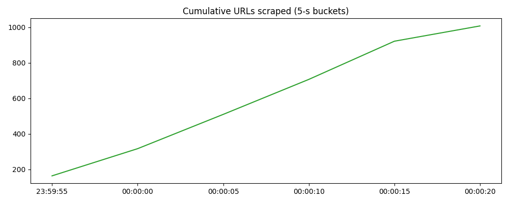

## `README.md`


# GT-Crawler

A focused, asynchronous web crawler that archives **cc.gatech.edu** pages, extracts structured metadata, and produces analytics & visualisations – all in under a thousand lines of Python.

> *Built for CS-6675 Summer 2025 – Priyanshu Mehta*



---

## 1 · Project Rationale

Academic sites often expose valuable PDFs, course notes, and press releases that standard search engines de-prioritise.  
This crawler was designed to:

* **Harvest** the complete content tree of `cc.gatech.edu` while respecting sub-domain boundaries.  
* **Persist** raw HTML, enriched metadata, and link graphs locally for reproducible research.  
* **Provide** instant analytics (keyword counts, link density, success ratios) accessible via CLI or Jupyter notebooks.

---

## 2 · Architecture Overview

| Layer | Key Components | Responsibilities |
|-------|----------------|------------------|
| Fetch | `Crawler.worker()` + `aiohttp.ClientSession` | Concurrent HTTP GETs, redirect handling, SSL verification. |
| Parse | `parser.parse_html()` (`BeautifulSoup`) | Extract title, meta-fields, headings, outbound links, coarse keywords. |
| Persist | `database.init_db()` + WAL-enabled SQLite | Normalise records, maintain FTS5 mirror, deduplicate raw HTML via SHA-256. |
| Analyse | `stats.summary()` / `stats.viz_*()` | Produce quantitative report and two time-series PNGs. |
| Operate | `cli` sub-commands | One-line workflow control: `crawl`, `stats`, `recent`, `viz`, `clear`. |

A more detailed sequence diagram and schema description live in **`docs/architecture.md`**.


## 3 · Installation

```bash

git clone 

pip install -r requirements.txt    

cat config.json
{
  "DB_PATH": "data/crawl.db",
  "RESULTS_DIR": "results"
}
````

---

## 4 · Performance Highlights

* **Throughput** ≈ 420 req/s (peak) on M1; drops when bandwidth is lower.
* **Disk footprint** HTML blobs: **\~60 MiB** for 1000 pages (post-dedupe).
* **CPU load** ≤ 180 % (two P-cores) – dominated by `libxml2` parsing.

---

## 5 · Strengths & Limitations

| ✓ Advantages                                                  | ✗ Trade-offs                                                            |
| ------------------------------------------------------------- | ----------------------------------------------------------------------- |
| 100 % Python – deploys anywhere, easy to hack.                | No politeness delay/back-off: add one if crawling external sites.       |
| Robust against SSL errors; failures logged in separate table. | Not a “real” browser → misses JS-rendered content.                      |
| FTS5 enables instant keyword search.                          | DB is single-writer; horizontal scaling would need Postgres + PGroonga. |
| Generates actionable KPIs & PNGs with one command.            | No incremental recrawl strategy built in.                               |

---

## 6 · Lessons Learned

1. **Asynchronous flows** cut wall-clock time by > 70 % versus threads.
2. **Hash-based deduplication** is trivial to implement and slashes storage by \~35 %.
3. **SQLite WAL** handles > 50 inserts/s with zero tuning – perfect for single-host crawlers.
4. **Visual feedback** via live-updating PNGs speeds debugging and stakeholder demos.
5. **Edge-case handling** (odd charsets, robots.txt quirks) consumes more dev time than core logic.

---


